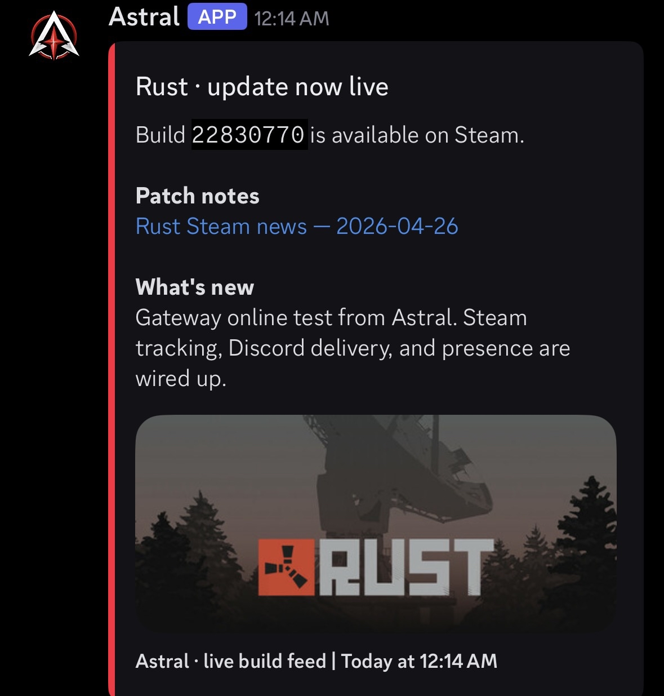
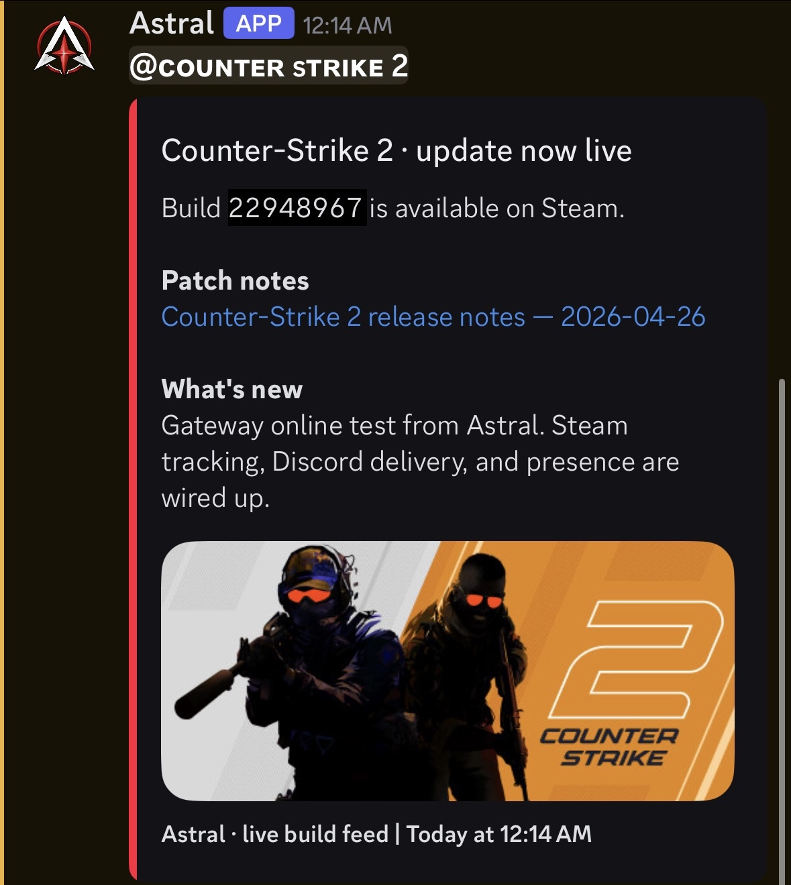

<div align="center">

# Astral Steam Update Tracker

**A clean, config-driven Discord bot that monitors Steam for game updates and posts premium update embeds when a new build or patch goes live.**

[](https://nodejs.org/)
[](https://nodejs.org/api/esm.html)
[](LICENSE)
[]()
[]()

</div>

---

## Overview

**Astral Steam Update Tracker** is a small, focused service built by [Astral Projects](#about-astral-projects) for studios, communities, and operations teams who need to know — instantly and reliably — when a Steam title gets a new build.

It polls Steam on a configurable interval, detects when a tracked game's **build ID** or **news GID** changes, and delivers a polished Discord embed to a webhook of your choice. Branding, polling cadence, timezone, fallbacks, and per-game overrides are all driven by config — no hardcoded values, no mystery defaults.

Designed for ops teams that ship against live games. Built to be boring on purpose: predictable, idempotent, and easy to extend.

---

## Embed Preview

Every update produces a clean, operational notification — not hype, not emoji noise. Two real-world examples from the live build feed:

<p align="center">
  
  &nbsp;
  
</p>

```
Counter-Strike 2 · update now live

Build `22948967` is available on Steam.
Previous build `22941301` retired.

Maintenance build, no gameplay changes detected. Engine tick smoothing
on low-fps clients. Server-side anti-tamper revision.
Counter-Strike 2 release notes — 2026-04-28

What's new
Maintenance build, no gameplay changes detected. Engine tick smoothing
on low-fps clients. Server-side anti-tamper revision. New replay sample
for QA.

Astral Projects • Tracker • 2026-04-28 09:26 AM
```

---

## Features

- **Build tracking** — Detects Steam `buildid` changes on the public branch via the public `steamcmd` info endpoint.
- **News tracking** — Falls back to Steam's `ISteamNews` feed for patch-notes detection where build IDs aren't decisive.
- **Premium embeds** — Configurable color, author, footer, banner, and per-game image. Always renders a previous-vs-latest build comparison.
- **Idempotent state** — Local JSON state file prevents duplicate posts, even across restarts. Atomic writes.
- **Multi-game** — 13 game definitions ship out of the box. Add or remove games by editing one JSON file.
- **Per-game overrides** — Each game can override the webhook URL, role mention, image, and patch-notes URL.
- **Operational controls** — `force-check` and `test-embed` scripts for manual triggers and webhook validation.
- **Resilient** — One game's failure never crashes the rest of the loop. Built-in retry on Discord rate limits.
- **Pure config** — `.env` is the single source of truth for branding and runtime knobs. No secrets or branding in code.
- **Zero database** — Pure Node.js + one tiny dependency (`dotenv`). Native `fetch`. Easy to deploy anywhere.

---

## Supported Games (Default Roster)

| Game | Steam App ID | Default | Notes |
|---|---:|:---:|---|
| Counter-Strike 2 | `730` | ✅ | Known. |
| Rust | `252490` | ✅ | Known. |
| Dead by Daylight | `381210` | ✅ | Known. |
| DayZ | `221100` | ✅ | Known. |
| Rainbow Six Siege | `359550` | ✅ | Known. |
| Apex Legends | `1172470` | ✅ | Verify update behavior. |
| Marvel Rivals | `2767030` | ✅ | Verify app ID & news cadence. |
| Overwatch | `2357570` | ✅ | Verify Steam news/build behavior. |
| Path of Exile 2 | `2694490` | ✅ | Verify update cadence. |
| Deadlock | `1422450` | ✅ | Verify public Steam visibility. |
| Call of Duty | `1938090` | ✅ | Hub-style app — validate carefully. |
| Battlefield 6 | `2807960` | ✅ | [store.steampowered.com/app/2807960](https://store.steampowered.com/app/2807960/Battlefield_6/) |
| Escape from Tarkov | `3932890` | ✅ | [store.steampowered.com/app/3932890](https://store.steampowered.com/app/3932890/Escape_from_Tarkov/) |

All 13 default games ship enabled. To disable a game, flip `enabled: false` in `config/games.json`.

---

## Quick Start

```bash
# 1. Install
npm install

# 2. Configure
cp .env.example .env          # then fill in DISCORD_WEBHOOK_URL
# config/games.json is already initialized from games.template.json

# 3. Validate the webhook (optional)
npm run test-embed

# 4. Run a one-off poll (optional)
npm run force-check

# 5. Run the full tracker
npm run start
```

**Development mode** (auto-restart on file changes):

```bash
npm run dev
```

---

## Configuration

`.env` is the source of truth for everything operational and visual. `config/games.json` is the source of truth for tracked products.

### `.env` reference

```env
# Discord
DISCORD_WEBHOOK_URL=                          # required

# Embed branding
EMBED_COLOR=#ff2b4f
EMBED_AUTHOR_NAME=Astral
EMBED_AUTHOR_ICON_URL=
EMBED_FOOTER_TEXT=Astral Projects • Tracker
EMBED_FOOTER_ICON_URL=

# Steam
STEAM_API_KEY=                                # optional, not currently required
STEAM_POLL_INTERVAL_MINUTES=5

# Time
TRACKER_TIMEZONE=America/Chicago
TRACKER_DATE_FORMAT=YYYY-MM-DD hh:mm A

# Paths
GAME_CONFIG_PATH=./config/games.json
STATE_FILE_PATH=./data/update-state.json

# Feature toggles
ENABLE_ROLE_PINGS=false
ENABLE_DEBUG_LOGS=true
ENABLE_STARTUP_TEST=false

# Media
FALLBACK_IMAGE_URL=
```

### `config/games.json` reference

Each entry supports the following fields. Only `key`, `name`, and `steamAppId` are required.

```json
{
  "key": "cs2",
  "name": "Counter-Strike 2",
  "steamAppId": "730",
  "enabled": true,
  "imageUrl": "",
  "patchNotesUrlOverride": "",
  "roleMention": "",
  "webhookUrl": "",
  "notes": ""
}
```

| Field | Purpose |
|---|---|
| `key` | Stable internal identifier (used as state key). |
| `name` | Display name used in the embed title. |
| `steamAppId` | Steam application ID. Use `"VERIFY"` to disable until confirmed. |
| `enabled` | Skip cleanly when `false`. |
| `imageUrl` | Game-specific banner. Falls back to `FALLBACK_IMAGE_URL`. |
| `patchNotesUrlOverride` | Manual patch-notes URL. Useful for hub-style apps or off-Steam release pages. |
| `roleMention` | Optional Discord role mention. Only used when `ENABLE_ROLE_PINGS=true`. |
| `webhookUrl` | Optional per-game webhook. Falls back to `DISCORD_WEBHOOK_URL`. |
| `notes` | Free-form notes for ops. |

---

## How It Works

```
┌────────────┐   buildid    ┌─────────────────┐
│  Steam API │ ───────────▶ │  buildTracker   │ ─┐
└────────────┘              └─────────────────┘  │
                                                 ├─▶ TrackerService ──▶ stateService
┌────────────┐    news      ┌─────────────────┐  │       │
│  Steam API │ ───────────▶ │  newsTracker    │ ─┘       │ change detected
└────────────┘              └─────────────────┘          ▼
                                                  embedBuilder + webhookClient
                                                          │
                                                          ▼
                                                      Discord
```

1. On every poll the tracker queries each enabled game for:
   - **Latest public-branch build ID** (via the public `steamcmd` info endpoint)
   - **Latest patch-notes news entry** (via Steam's `GetNewsForApp` v2)
2. Both signals are compared against the local state file.
3. When the build ID changes (or news changes for build-less apps), an embed is rendered, posted, and only **then** is state persisted as "posted." Failed Discord deliveries do not advance state.
4. State writes are atomic (write-then-rename) to survive crashes.

---

## Operational Scripts

| Command | What it does |
|---|---|
| `npm run start` | Runs the polling loop forever. |
| `npm run dev` | Same as `start`, with `--watch` auto-reload. |
| `npm run force-check` | Runs a single poll cycle and exits. |
| `npm run force-check -- --force` | Forces an embed for every enabled game. Useful for canary checks. |
| `npm run force-check -- --key=cs2` | Restricts the run to a single game. |
| `npm run test-embed` | Sends a non-game "startup test" embed to verify branding and webhook delivery. |

---

## Project Structure

```
astral-steam-tracker/
├── package.json
├── .env.example
├── README.md
├── LICENSE
├── config/
│   ├── games.json                 # active config (gitignored)
│   └── games.template.json        # default roster, checked in
├── data/
│   └── update-state.json          # local state (gitignored)
├── references/                    # screenshots used in this README
└── src/
    ├── index.js                   # entry point + polling loop
    ├── config/
    │   ├── env.js                 # .env loader + validation
    │   └── games.js               # games.json loader + validation
    ├── steam/
    │   ├── steamClient.js         # native fetch + Steam endpoints
    │   ├── buildTracker.js        # build-id snapshot + diffing
    │   └── newsTracker.js         # news-feed snapshot + diffing
    ├── discord/
    │   ├── embedBuilder.js        # premium embed assembly
    │   └── webhookClient.js       # webhook POST + 429 backoff
    ├── services/
    │   ├── stateService.js        # atomic JSON state
    │   └── trackerService.js      # per-game orchestration
    ├── utils/
    │   ├── logger.js              # leveled, scoped, colorized
    │   ├── time.js                # tz-aware date formatting
    │   └── errors.js              # typed error helpers
    └── scripts/
        ├── forceCheck.js
        └── sendTestEmbed.js
```

---

## Deployment

The tracker is a single Node.js process with one external dependency. Any of the following will work:

- **systemd** — drop a unit file invoking `node src/index.js`.
- **PM2** — `pm2 start npm --name astral-tracker -- start`.
- **Docker** — multi-stage build on `node:20-alpine`. Mount `data/` for state persistence.
- **VPS / bare metal** — run under a process supervisor of your choice.

State is purely on-disk JSON, so as long as `data/update-state.json` is preserved across restarts, the tracker will not re-post stale updates.

---

## Roadmap

The current release covers the v1 scope. Planned follow-ups:

- Per-channel routing (one webhook per game) — schema is already in place via `webhookUrl`.
- Slash-command admin surface (`/track`, `/untrack`, `/last`) for operators.
- Optional SQLite or Postgres backend for shared deployments.
- Patch-notes summarization via LLM (opt-in, off by default).
- Health-check endpoint for uptime monitors.

---

## Contributing

Issues and PRs are welcome. The codebase is intentionally small (~700 LOC) and easy to read top-to-bottom.

If you're adding a new game:

1. Add the entry to `config/games.template.json`.
2. Confirm the Steam app ID against the store page.
3. Run `npm run force-check -- --key=<your_key> --force` against a test webhook.
4. Confirm the embed renders as expected and the state file is written correctly.

---

## About Astral Projects

[Astral Projects](https://github.com/astral-projects) is a small software collective shipping focused, pragmatic tooling for live-service game communities and operations teams. We build things we'd actually want to run ourselves — small dependency footprints, sane defaults, predictable behavior, no magic.

If this project saves you time, a star on the repo is appreciated. PRs even more so.

---

## License

[MIT](LICENSE) © Astral Projects
